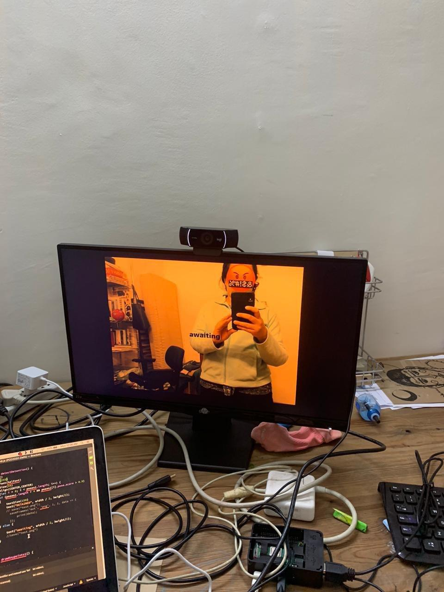

# PCD-2020-dontassemble

This installation is built on p5.js and ml5js. It uses the poseNet library to identify the number of people in the camera feed. If you are more than 5 people the program "detains" you. 

You will need to run the project as a localhost on browser. 

